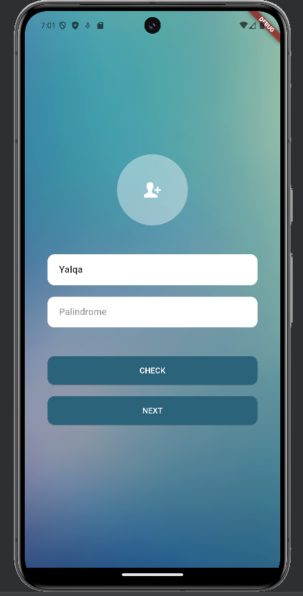
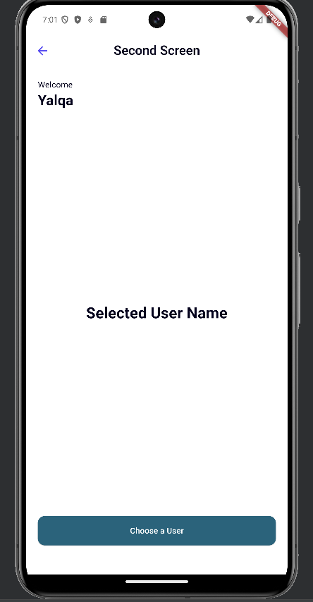
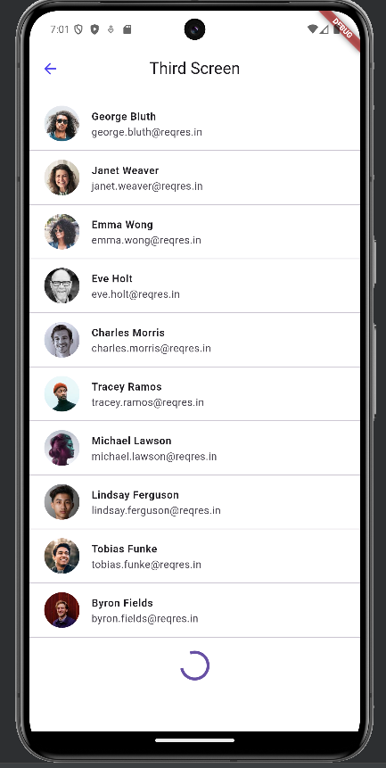

# Palindrome & User List App by Muhammad Yalqa

Aplikasi ini dibuat untuk memenuhi task *Magang Berdampak 2025 - Mobile Developer Intern - Suitmedia*.

## Task Description

Create iOS / Android application with the following specification:

- Flutter version: 3.32 or above
- State Management: GetX

### Application Requirements:

#### 1. First Screen

- Two input fields:
  - Name input
  - Sentence input (to check if the sentence is a palindrome)
- "Check" button:
  - Displays dialog:
    - `"isPalindrome"` if sentence is a palindrome
    - `"not palindrome"` if not
- "Next" button:
  - Navigates to the second screen

#### 2. Second Screen

- Displays:
  - Static text: `"Welcome"`
  - Dynamic text: name from the first screen
  - Dynamic text: `"Selected User Name"`
- "Choose a User" button:
  - Navigates to the third screen

#### 3. Third Screen

- Displays a list of users fetched from [https://reqres.in/api/users](https://reqres.in/api/users)
- Shows user email, first name, last name, and avatar
- Features:
  - Pull to refresh
  - Load next page when scrolling to the bottom
  - Empty state if no users found
- When a user is selected:
  - Goes back to the second screen and updates `"Selected User Name"` with the chosen user’s name

## Tech Stack

- Flutter 3.32+
- GetX for state management and routing
- ReqRes API for dummy user data

## Installation

```bash
flutter pub get
flutter run
```

## Screenshots





---

**Note:** Aplikasi ini dikembangkan sebagai bagian dari proses seleksi *Magang Berdampak 2025* dan hanya untuk keperluan demonstrasi dan evaluasi.

